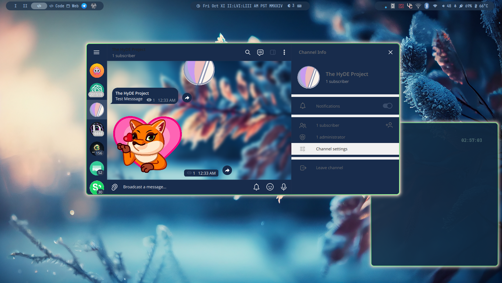
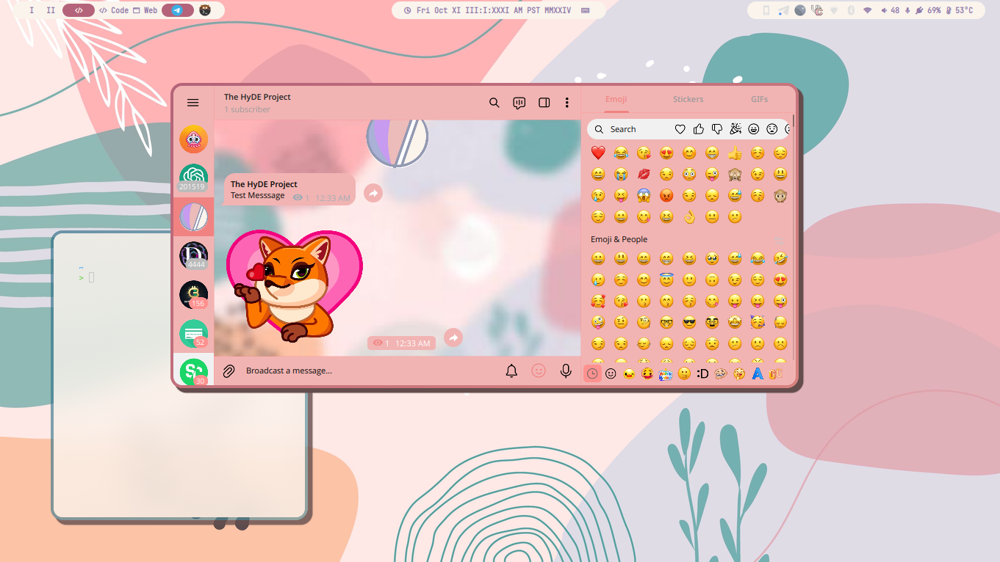
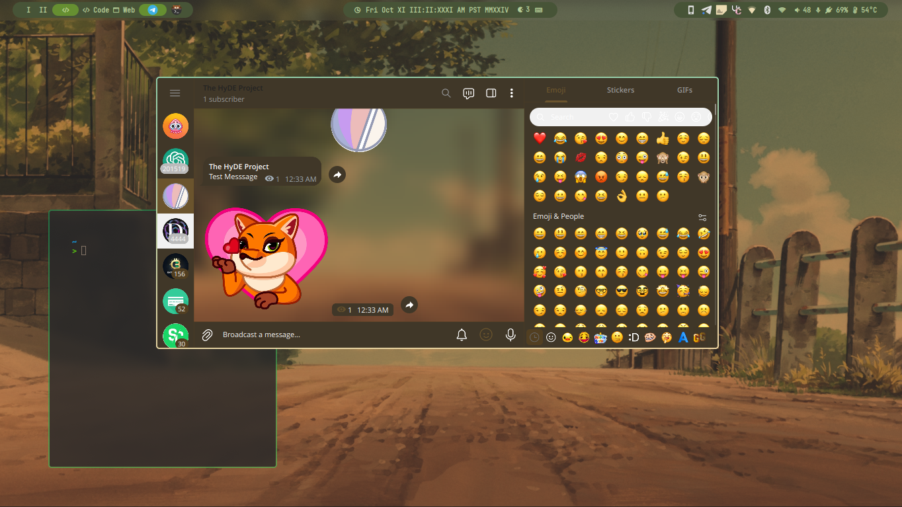
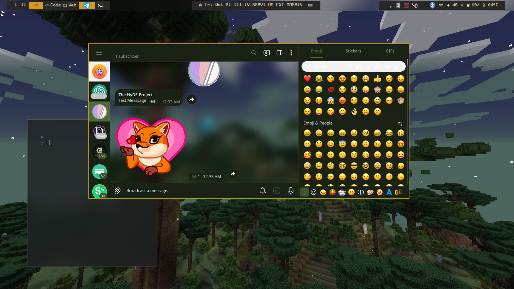

# Telegram HyDE Wallbash Template

HyDE's wallbash template for Telegram.

## Preview






## Usage

### Integrating into HyDE

To integrate this template, add the file `/telegram.dcol` to either of the following directories:

- `~/.config/hyde/wallbash/Wall-Ways`
- `~/.config/hyde/wallbash/Wall-Dcol`

#### Difference Between Wall-Ways and Wall-Dcol

- **Wall-Ways**: This file is always used regardless of the theme mode or wallbash mode.
- **Wall-Dcol**: This file attempts to find the theme template (if in theme mode) and falls back to using the dominant color of the wallpapers if no template is available.

### Using This Template for Themes

1. **Header Line**:
    ```sh
    ${cacheDir}/landing/wallbash-telegram.sh | wallbash.telegram.sh 
    ```

    Here, `$cacheDir` refers to the path `~/.cache/hyde/`.

2. **Wallbash Generation (1st part column)**:
    ```sh
    ${cacheDir}/landing/wallbash-telegram.sh
    ```
    This command generates the `wallbash-telegram.sh` file.

3. **Optional Command (2nd part column)**:
    ```sh
    wallbash.telegram.sh
    ```
    This command uses the cached wallbash-generated `wallbash-telegram.sh` file to generate a more sophisticated Telegram theme.

## Thanks

- Special thanks to [Guillaume Boehm](https://github.com/guillaumeboehm/wal-telegram) for the awesome script.

## Checkout

- [Telegram](https://telegram.org/)
